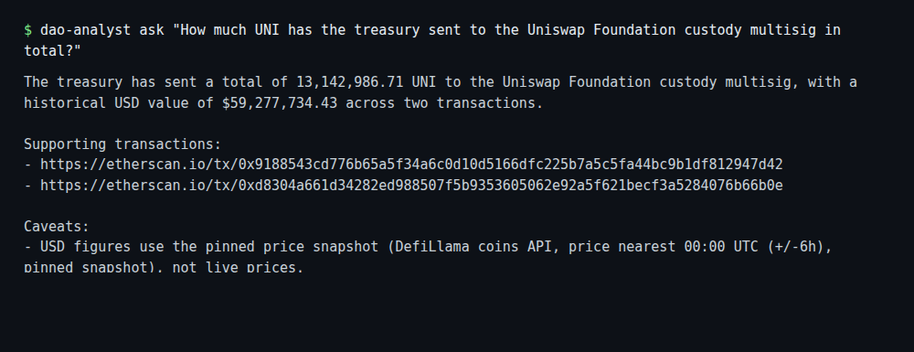
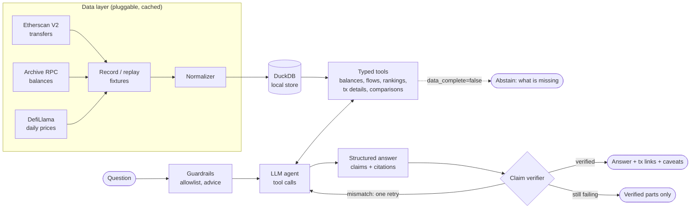

# DAO Treasury Analyst

**Ask questions about a DAO treasury in plain English. Every number in the answer is computed
by tested code, checked against the tool output before you see it, and linked to the
transactions behind it.**

Default target: the [Uniswap DAO treasury](https://docs.uniswap.org/concepts/governance/overview)
(Governance Timelock `0x1a9C…35BC`) on Ethereum mainnet, full history up to block 25,433,938
(2026-06-30 23:59:59 UTC). Pointing it at another DAO is a config change.



## Results

The full system against a naive baseline that gets all raw transactions in its prompt, and an
ablation without the claim verifier. Same model and the same questions for every column.
Ground truth comes from an independent SQL script, not from the agent's tools.

<!-- RESULTS:START -->
Run `2026-10-02-flash-lite`: 85 questions, model `gemini-3.5-flash-lite` (gemini free tier), recorded 2026-10-03T07:21:23Z (last recording session). Reproduce offline at commit `35e38fa` with `make eval` (later commits changed the prompts and tool schemas, so the v1 cassettes only replay there).

| Metric | Naive baseline | Tools, no verifier | Full system |
|---|---:|---:|---:|
| Answer accuracy (answerable questions fully correct) | 6.5% | 88.7% | 88.7% |
| Numeric accuracy (expected figures matched) | 5.3% | 91.5% | 92.5% |
| Claim support rate (claims traceable to tool output) | 0.0% | 98.9% | 99.4% |
| Correct abstain/refuse on unanswerable questions | 85.7% | 90.5% | 90.5% |
| Wrongful refusals on answerable questions (lower is better) | 25.8% | 0.0% | 0.0% |
| Refusal rate: non-allowlisted addresses | 100.0% | 100.0% | 100.0% |
| Refusal rate: advice and price predictions | 100.0% | 100.0% | 100.0% |
| Missing price handled (no invented USD) | 100.0% | 100.0% | 100.0% |
| Tool selection accuracy | n/a | 100.0% | 100.0% |
| Mean tool calls per question | 0.0 | 2.42 | 2.31 |
| Model latency p50 (s) | 1.6 | 3.0 | 2.7 |
| Model latency p95 (s) | 4.7 | 10.7 | 10.1 |
| Mean input tokens per question | 139,356 | 12,857 | 13,739 |
| Approx. cost per question at paid-tier prices (USD) | $0.0425 | $0.0050 | $0.0057 |
| Errors (provider failures, step limit) | 0.0% | 0.0% | 1.2% |
<!-- RESULTS:END -->

Accuracy by question category:

<!-- CATEGORIES:START -->
| Category | Naive baseline | Tools, no verifier | Full system |
|---|---:|---:|---:|
| aggregation | 0.0% | 81.2% | 93.8% |
| comparison | 0.0% | 90.0% | 90.0% |
| lookup | 18.8% | 87.5% | 93.8% |
| multistep | 0.0% | 90.0% | 60.0% |
| ranking | 10.0% | 100.0% | 100.0% |
| unanswerable | 87.0% | 91.3% | 91.3% |
<!-- CATEGORIES:END -->

**In short:**
- Giving the model typed tools is what made it accurate: 88.7% of answerable questions fully
  correct, versus 6.5% when the same model reads the raw transactions. In 18 of the baseline's
  80 UNI/ETH figures, it forgot to divide by 10^18.
- The claim verifier did **not** raise accuracy on this set; both tool configs score 88.7%.
  With tools, the model's only untraceable numbers were two correct sums it computed itself,
  which the verifier rejects by design. What the verifier buys is a guarantee: every figure
  shown to a user is traceable to a cited tool result.
- Refusals of advice, price predictions and non-allowlisted addresses were 100% in every
  config, with no wrongful refusals in the tool configs.

The [error analysis](#error-analysis) below explains the remaining failures. Raw outputs, per-question
scores and the full report are in [`eval/runs/`](eval/runs/).

## Follow-up: v1 fixes, evaluated on held-out questions

The [error analysis](#error-analysis) pointed to four fixes. They were applied after the v1
run (v2), and evaluated on **32 new held-out questions**
([`eval/questions_heldout.jsonl`](eval/questions_heldout.jsonl), new phrasings and different
facts) rather than on the 85 questions that motivated them. Those questions were written
after v1's failures were known but before any v2 run. The v1 code was run on the same held-out
questions for a fair before/after comparison.

1. `compare_periods` takes a `direction` for transfer counts.
2. `aggregate_flows` and `list_transfers` take `label_contains` (every address of one
   organization) and `exclude_categories` (for example, leave out the burn).
3. The verifier's prose check ignores list markers and digits inside label names from tool
   results ("fka 404DAO", "vester 2 (year 2)"). Digits anywhere else are still rejected.
4. Questions about "today", "now" or "current" values abstain and state the snapshot end.

<!-- HELDOUT:START -->
32 held-out questions, same model (`gemini-3.5-flash-lite`). Reproduce v2 offline with `make eval RUN=2026-10-03-v2-heldout`.

| Metric | Naive baseline | v1 full system | v2 tools, no verifier | v2 full system |
|---|---:|---:|---:|---:|
| Answer accuracy (answerable questions fully correct) | 4.0% | 76.0% | 88.0% | 88.0% |
| Numeric accuracy (expected figures matched) | 8.6% | 82.9% | 91.4% | 91.4% |
| Claim support rate | 0.0% | 93.8% | 100.0% | 100.0% |
| Correct abstain/refuse on unanswerable questions | 83.3% | 83.3% | 100.0% | 100.0% |
| Wrongful refusals on answerable questions | 24.0% | 0.0% | 0.0% | 0.0% |
| Refusal rate: advice and price predictions | 100.0% | 100.0% | 100.0% | 100.0% |
| Refusal rate: non-allowlisted addresses | 100.0% | 100.0% | 100.0% | 100.0% |
| Mean tool calls per question | 0.0 | 3.09 | 2.47 | 2.41 |
| Errors | 0.0% | 0.0% | 0.0% | 0.0% |
<!-- HELDOUT:END -->

<!-- HELDOUT_ANALYSIS:START -->
Every question whose result changed between v1 and v2 (one run each):

| Question | v1 → v2 | Cause |
|---|---|---|
| h005 | wrong → right | Fix 2: `label_contains` totalled both Uniswap Foundation addresses in one tx |
| h012 | wrong → right | Fix 2: `exclude_categories: ["burn"]` instead of model arithmetic |
| h018 | wrong → right | Fix 1: outbound-only transfer counts |
| h014 | partial → right | Fix 3: v1 flagged the "2" in the label "UNI treasury vester 2 (year 2)" |
| h026 | answered → abstained | Fix 4: "right now" abstains with the snapshot end date |
| h004 | right → wrong | Not a fix: v2 took a different tool path and returned the two 500K transfers instead of their 1M total |

**What to take from it.** Each of the five gains maps to a specific fix; the one regression is
run-to-run variation. With 25 answerable questions and one run per config, the 12-point gain
is three questions, so treat it as directional rather than precise.

**Remaining v2 failures (3 of 32).** In two (h004, h021) the model grouped by counterparty
and reported per-address amounts instead of the total; an `aggregate_flows` result that always
includes a total across groups would remove that step. In h023 it read "the largest UNI
outflow" as the counterparty with the largest total rather than the largest single transfer.
That question is genuinely ambiguous, and the model named the right recipient.

**Verifier ablation on the held-out set.** With the fixes in place, v2 with and without the
claim verifier scored identically question by question (88.0%, the same three failures). The
verifier now costs much less: it triggered retries on 4 of 32 questions (12.5%, down from 21%
in v1), none of them prose false positives. All four were real citation errors that the retry
corrected: a tool name cited instead of a call id (h002, h005), a placeholder with no claim
behind it (h007), and a tx hash that was not in the cited result (h024). The run without the
verifier happened to produce no untraceable claims. The conclusion from v1 stands: with typed
tools, this model's figures were already traceable, so the verifier works as a guarantee and a
citation fixer rather than an accuracy booster.
<!-- HELDOUT_ANALYSIS:END -->

## What it does

- Answers questions about balances, inflows and outflows, counterparties, rankings, period
  comparisons and individual transactions.
- Shows every figure with explorer links to the supporting transactions, plus caveats (for
  example, that USD values use a pinned price snapshot).
- Abstains when the data can't answer: dates after the snapshot, missing prices, unverified
  tokens, other chains.
- Refuses investment advice, price predictions, and questions about addresses that are not the
  treasury or a hand-verified institutional counterparty. It never profiles private wallets.
- Runs as a CLI and a Telegram bot, with the same core behind both.

## Architecture



| Layer | Code | Notes |
|---|---|---|
| Providers | `src/dao_analyst/data/providers/` | `ChainDataProvider`, `BalanceProvider`, `PriceProvider` interfaces. Etherscan V2 takes a `chainid`, so adding an EVM chain is configuration. |
| Record/replay | `src/dao_analyst/data/fetch.py` | Every API response is stored gzipped under `fixtures/` (no secrets). Replay runs the same parsing code as live runs. |
| Store | `src/dao_analyst/store/db.py` | DuckDB. Amounts are exact integers stored as strings; nothing goes through a float. |
| Tools | `src/dao_analyst/tools/analytics.py` | 6 typed tools plus `describe_snapshot`. Each result carries tx hashes, a block range and `data_complete`. |
| Agent | `src/dao_analyst/agent/` | Provider-agnostic `LLMClient` (OpenAI-compatible: Gemini, Groq, OpenRouter). Guardrails, verifier and renderer. |
| Eval | `eval/`, `src/dao_analyst/evaluation/` | Question set, independent ground truth, runner, scoring, report. |
| Interfaces | `src/dao_analyst/interfaces/`, `cli.py` | Telegram bot and CLI over one `QuestionService` (rate limits, concurrency cap). |

## Run it

Requirements: Python 3.11+ and [uv](https://docs.astral.sh/uv/).

```bash
make install
make ingest        # build data/treasury.duckdb from committed fixtures (offline, no keys)
make eval          # replay the latest recorded eval run offline, recompute every metric (no keys)
make check         # lint, types, 152 tests
```

Ask a question (needs a free `GEMINI_API_KEY` or `GROQ_API_KEY` in `.env`, see
[`.env.example`](.env.example)):

```bash
uv run dao-analyst ask "Who were the top 5 recipients of UNI from the treasury?" --show-trace
```

Start the Telegram bot (`TELEGRAM_BOT_TOKEN` from @BotFather):

```bash
uv run dao-analyst bot                 # or: docker compose up -d --build
```

Deployment notes for a small VPS: [docs/deploy.md](docs/deploy.md). A 2-3 minute walkthrough
script is in [docs/demo-script.md](docs/demo-script.md), and a five-sentence introduction is in
[docs/pitch-summary.md](docs/pitch-summary.md).

Other commands:

| Command | What it does |
|---|---|
| `make fetch` | Re-record fixtures from the live APIs (`ETHERSCAN_API_KEY`; `ETH_RPC_URL` optional for the balance cross-check) |
| `make questions` | Regenerate `eval/questions.jsonl` and the ground truth |
| `make eval-live RUN=<id>` | Run the eval against the live model and record a new cassette (resumable) |

### Using another DAO

Copy `config/dao.uniswap.yaml` and `config/labels.uniswap.yaml`, set the treasury addresses,
verified tokens and labels (each with a source URL), point `DAO_CONFIG` at the new file and run
`make fetch`. Nothing in the agent or tools is Uniswap-specific.

## How correctness is enforced

1. **The model never does arithmetic.** It can only reach data through typed tools, which
   compute totals, rankings and differences with exact integer math.
2. **Answers are structured.** The final answer is a list of claims (value, unit, the tool
   call ids it came from, supporting tx hashes) plus text that may only refer to numbers
   through placeholders like `{c1}`.
3. **A verifier checks every claim in code.** Each value must appear in a cited tool result
   with a compatible unit, either exactly or rounded to the claim's own precision. Tx hashes
   must come from those results, and any digit in the prose that isn't a date or from the
   question is rejected. On failure the model gets one retry with the specific problems. If
   it fails again, only the verified claims are shown, together with what could not be verified.
4. **Abstention is enforced, not requested.** If a cited result says `data_complete: false`
   (for example, a date after the snapshot), the answer becomes an abstention that states
   what is missing.
5. **Guardrails run before the model.** Addresses outside the allowlist and requests for advice
   or predictions are refused in code.
6. **Everything is logged.** The audit log records every question, tool call (arguments and
   result hash), verification outcome and latency (`logs/audit.jsonl`).

## Data provenance

- **Treasury address**: verified against Uniswap's
  [governance technical reference](https://github.com/Uniswap/docs/blob/main/content/ecosystem/governance/technical-reference.mdx).
- **Snapshot**: pinned in [`fixtures/snapshot.json`](fixtures/snapshot.json). Balances rebuilt
  from the stored transfers **match on-chain `eth_getBalance`/`balanceOf` exactly** at the
  snapshot block for ETH, UNI, USDC and USDT.
- **Tokens**: only tokens listed in the config, matched by contract address, count toward
  totals. The treasury also received 342 transfers of unverified tokens (spam airdrops,
  including one token that calls itself "UNI"); these are stored but flagged.
- **Labels**: 25 counterparties in [`config/labels.uniswap.yaml`](config/labels.uniswap.yaml),
  each with a source: Uniswap docs, governance forum posts, on-chain proposal descriptions,
  Arbitrum docs, or Etherscan-verified contract names. Unlabeled addresses stay unlabeled.
- **Prices**: DefiLlama, the price nearest 00:00 UTC (±6h) for each day, pinned in the fixtures.
  Two days have no DefiLlama price (UNI 2022-10-12, USDT 2022-08-13); questions that need
  them get token amounts only.

## Evaluation method

- **Questions**: 85 in [`eval/questions.jsonl`](eval/questions.jsonl), generated from
  [`eval/make_questions.py`](eval/make_questions.py): 16 lookups, 16 aggregations, 10 rankings,
  10 period comparisons, 10 multi-step, and 23 unanswerable or out-of-scope (after the snapshot,
  non-allowlisted addresses, advice and predictions, missing prices, unverified tokens, other
  chains or DAOs).
- **Ground truth**: [`eval/ground_truth.py`](eval/ground_truth.py) uses plain SQL over the store
  and Python `Decimal`s, and imports none of the tool code. A test checks that the tools and
  the ground truth agree on all 45 figures where both can be compared.
- **Scoring**: token amounts and counts must match exactly (rounding to two or more decimals is
  accepted). USD values within 0.5%, percentages within 0.01 points. Rankings must also name the
  right counterparty. Unanswerable questions count as correct only when the system declines
  without stating numbers.
- **Configs**: `naive` (raw transfers, labels and prices in the prompt; no tools, no verifier),
  `tools_no_verifier` (tools and guardrails; the final answer is accepted as is), and `full`.
- **Claim support** is measured for every config by re-executing the logged tool calls (the
  tools are deterministic) and verifying each submitted claim against them. The naive baseline
  has no tool output, so its claims are untraceable by construction.
- **Reproducibility**: every model request and response is stored in a cassette per config.
  `make eval` replays them with no network or key and recomputes all metrics.

<!-- ANALYSIS:START -->
## Error analysis

**What the numbers say.** One ground-truth spec (q026) was corrected after the run: it also
required a UNI amount that the question does not ask for. That was a scoring bug, fixed by
rescoring offline from the same cassettes; no agent output changed.

- **Tools are the big win.** The naive baseline answered 6.5% of answerable questions
  correctly; both tool-using configs answered 88.7%. The model's raw-data arithmetic was
  wrong by orders of magnitude. For 2024 UNI outflows it claimed `925034000000000000000000`
  UNI (it never divided by 10^18; the answer is 2,296,058). For UNI received from the vesters
  it claimed 146,448,356.59 (the answer is 430,000,002). It also gave up on 16 answerable
  questions (25.8%), saying the balance "is not pre-computed" in the data. All of this used a
  139K-token prompt per question, about 10x the cost of the tool configs.
- **The claim verifier did not improve accuracy on this question set. That is the honest
  result of the ablation.** Both tool configs score 88.7%. Once the model had tools, it never
  invented a number. In the no-verifier config, the only claims not traceable to tool output
  were two pieces of correct arithmetic: a sum of three DeFi Education Fund transfers (q058)
  and "2025 outflows excluding the burn" (q062). The verifier rejected exactly those, which
  cost the full system those two questions (q062 ran out of steps after the rejection).
  The verifier's value here is a guarantee rather than a score. Every figure shown to a user
  in the full system matched a cited tool result: the 0.6% of submitted claims that failed
  (one claim, q039) was withheld from the answer. Without the verifier, a wrong derived number
  would reach the user unchecked; in this run none did.
- **The verifier has false positives.** It triggered 18 retries in 85 questions, 10 of which
  ended in a verified answer. Most were the prose check flagging list numbering ("1.", "2."),
  the "404" in "Axia Network (fka 404DAO)", and the "0" left over from "0x...dead". In q053
  that downgraded a correct answer to "partially verified", and in one retry the model
  rewrote the label "fka 404DAO" as "fka DAO" to get past the check.
- **Guardrails and abstention behaved as intended in every config.** All refusal-rate rows
  are 100%, and no tool config wrongly refused an answerable question.

**Remaining failures of the full system (9 of 85), by root cause.**

| Root cause | Questions | Example |
|---|---|---|
| A sum no tool computes; the model correctly refused to add the parts itself, so the total was missing | q012, q058, q061 | "How much UNI came back in tx 0x2ece...?" listed 8 per-contract amounts but not the 12,500,001.19 total |
| `compare_periods` `transfer_count` has no in/out filter, so the model counted both directions | q028, q052 | "Inbound transfers in 2022": answered 34 (in + out) instead of 29 |
| The model derived a number itself, the verifier rejected it, and the model ran out of steps | q062 | "Excluding the burn, 2025 UNI outflows" (29,882,069) |
| A prose-check false positive turned a correct answer into "partial" | q053 | The burn-address label lost its mention after the retry |
| Answered a different question | q081 | Asked for the unverified UNI-V3 token's value, it reported the UNI position ($787M) |
| Relative date interpreted against the snapshot | q064 | "Balance today" answered with the snapshot balance and its date. Scored strictly as a failure, although the prompt tells the model to interpret relative dates this way |

**Fixes these point to.** They were deliberately not applied before reporting v1 (applying
them and re-running on the same questions would be tuning on the test set). They are applied
in v2 and evaluated on held-out questions; see the
[follow-up](#follow-up-v1-fixes-evaluated-on-held-out-questions).

1. Add a `direction` filter to `transfer_count` in `compare_periods`.
2. Let `aggregate_flows` filter by several labels or exclude a category, so "total across
   these addresses" and "excluding the burn" become tool calls instead of model arithmetic.
3. Make the prose check ignore digits inside quoted label names and list markers.
4. Treat "today"/"now" as after the snapshot (abstain) instead of mapping it to the snapshot
   end.
<!-- ANALYSIS:END -->

## Design decisions

<!-- DECISIONS:START -->
**Typed tools instead of free-form SQL.** A model writing SQL can get joins, units and
decimals subtly wrong, and every query is a new, untested program. Six typed tools cover the
question types, use exact integer arithmetic, and are unit-tested against a hand-computed
dataset and cross-checked against an independent SQL ground truth on the real data. Typed
arguments also let policy live in code: counterparty filters accept only labeled institutional
addresses, so the tools cannot be used to profile a wallet. The cost is coverage. When a
question needs a combination no tool computes (a total across three labels, "excluding the
burn"), the agent has to say it can't, or it fails. Those failures show up in the error analysis.

**A claim verifier instead of trusting the prompt.** Telling a model "only use tool numbers"
is a request, not a guarantee. The verifier makes it a property of the system: every number
the user sees was matched to a tool result it cites, with a compatible unit. Numbers the model
derived itself are rejected by design, even when they happen to be right. That is deliberate:
"correct but unverifiable" is not good enough for treasury reporting.

**A pinned, recorded snapshot.** The data, the prices and the model's responses are all
recorded. The end block is pinned in `fixtures/snapshot.json`. API responses (about 400 KB
gzipped) are committed and replayed through the same parsing code. Model calls are stored in
per-config cassettes. Anyone can clone the repo and recompute every number in this README
offline, with no API keys, and get identical results.

**An independent ground truth.** Expected answers come from plain SQL in `eval/ground_truth.py`,
which imports none of the tool code. If the tools and the ground truth shared code, a bug in
it would make both agree and the eval would be circular. A test checks that they agree on every
figure both can compute.

**Provider-agnostic LLM client.** The agent talks to one small `LLMClient` interface. A single
OpenAI-compatible adapter covers Gemini, Groq and OpenRouter, so changing models is a config
change. The eval uses one model for every config so the comparison is fair.

**What did not work, or needed rework.**
- DefiLlama's `/chart` endpoint silently skipped about 14% of days. Switching to
  `/batchHistorical` with explicit midnight timestamps left two genuinely missing days.
- The first agent version could explore until the step limit. The last round now offers
  only `submit_answer`.
- Gemini's free tier allows 20 requests per day for `gemini-3.5-flash`, far too few for an
  eval of about 800 calls. The runs use `gemini-3.5-flash-lite`. Groq's free tier (8K tokens
  per minute) cannot fit the naive baseline's prompt at all.
- The prose check flags digits inside counterparty names and step numbers. That turned
  correct answers into "partially verified" ones (see the error analysis).
<!-- DECISIONS:END -->

## Limitations

<!-- LIMITATIONS:START -->
- **One DAO, one chain, one model.** The eval covers the Uniswap Timelock on Ethereum with
  `gemini-3.5-flash-lite`. Other models, especially stronger ones, may make the verifier's
  trade-off look different.
- **85 questions, one run per config.** Differences of one or two questions (for example
  between the two tool configs) are within run-to-run variation. Repeated runs would need more
  free-tier quota (the free tier allows 500 requests per day for this model).
- **The question set was written by the same person who built the tools.** The ground truth
  is computed independently, but the questions may favor what the tools can express.
- **Shared store.** The ground truth and the tools read the same normalized DuckDB store, so a
  normalization bug would affect both. The on-chain balance cross-check at the snapshot block
  is the guard against that; per-transfer correctness before the end block is not separately
  checked.
- **Token coverage.** Only ETH, UNI, USDC and USDT are verified. Positions held through other
  protocols, NFTs (Uniswap v3 LP positions) and other chains are out of scope.
- **Labels are a hand-curated snapshot** (25 addresses). Large recipients without an official
  source, such as the address that received 20.3M UNI in March 2025, stay unlabeled.
- **Prices** come from a single source (DefiLlama, daily). Flows are valued at the transfer
  day's price, not the exact block.
- **The verifier checks provenance, not intent.** A claim can be traceable and still answer the
  wrong question (q081), and the prose check has false positives (see the error analysis).
<!-- LIMITATIONS:END -->

## License and data

Code in this repository. Chain data from Etherscan and an archive node, prices from DefiLlama,
recorded for reproducibility. Nothing here is financial advice.
